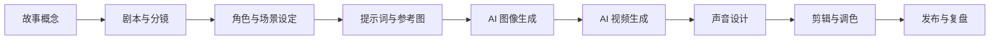

# AI 动画制作知识地图

## 创作链路

## 能力模块

- 动画基本功：动作是否清楚，表演是否可信。
- 故事能力：30-60 秒内是否有目标、阻碍、选择、变化。
- 镜头能力：景别、机位、运动、剪辑点是否服务叙事。
- 视觉开发：角色、场景、色彩、材质是否统一。
- AI 工具控制：能不能把“随机生成”变成“可复用流程”。
- 声音与剪辑：节奏、情绪、信息是否被声音和剪辑放大。
- 项目管理：每个镜头的状态、版本、提示词、素材来源是否可追踪。

## 学习顺序

1. 动画原则和镜头语言。
2. 短片故事结构和无对白叙事。
3. 角色一致性和风格板。
4. AI 图像生成。
5. AI 视频生成。
6. 声音、剪辑、发布。
7. 完整项目复盘。

## Obsidian 使用方法

- 每学一个概念，写成一张“理论卡”。
- 每试一个工具，写成一张“工具卡”。
- 每拆一个作品，写成一张“案例卡”。
- 每做一个镜头，保存提示词、参数、输出、失败原因。

## 推荐笔记类型

- 理论卡：概念、来源、例子、练习。
- 工具卡：入口、功能、适用镜头、限制、成本、官方指南。
- 提示词卡：目标、正向提示词、负向提示词、参数、输出链接。
- 案例卡：作品链接、镜头拆解、可迁移方法。
- 项目卡：镜头编号、状态、素材、提示词、版本、复盘。