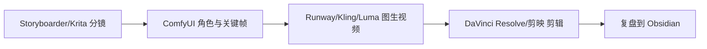

# 开源 AI 动画工作流

## 为什么学开源工具

商业 AI 工具适合快速产出，开源工具适合长期可控。真正做短片时，两者可以结合：商业工具负责速度，开源工具负责可重复和精细控制。

## 核心项目

### ComfyUI

GitHub：https://github.com/comfyanonymous/ComfyUI

用途：节点式 Stable Diffusion 工作流。

学习重点：

- Text-to-image。
- Image-to-image。
- ControlNet 姿势控制。
- IP-Adapter 参考图控制。
- 批量生成和工作流保存。

### Stable Diffusion WebUI Forge / AUTOMATIC1111

AUTOMATIC1111 GitHub：https://github.com/AUTOMATIC1111/stable-diffusion-webui

用途：快速上手 Stable Diffusion、插件生态丰富。

### AnimateDiff

GitHub：https://github.com/guoyww/AnimateDiff

用途：基于扩散模型的动画生成实验。

### ControlNet

GitHub：https://github.com/lllyasviel/ControlNet

用途：控制姿势、边缘、深度、构图。

### Blender

官网：https://www.blender.org/

文档：https://docs.blender.org/manual/en/latest/

用途：3D 预演、镜头布局、灯光、摄像机、剪辑、合成。

### Krita

官网：https://krita.org/

动画手册：https://docs.krita.org/en/user_manual/animation.html

用途：分镜、逐帧动画、角色设定表。

### OpenToonz

GitHub：https://github.com/opentoonz/opentoonz

用途：开源 2D 动画生产。

### Storyboarder

GitHub：https://github.com/wonderunit/storyboarder

用途：快速分镜和 animatic。

## 推荐混合流程

## 学习顺序

1. Storyboarder 或 Krita 做 animatic。
2. ComfyUI 做关键帧。
3. ControlNet/IP-Adapter 做一致性控制。
4. 商业视频工具生成镜头。
5. DaVinci Resolve 或剪映整合声音和剪辑。